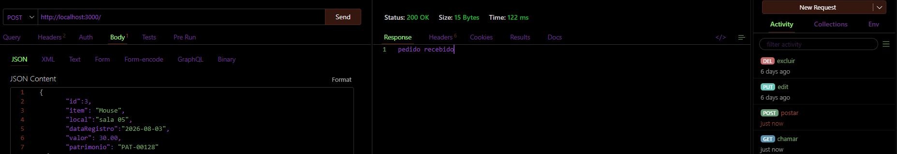
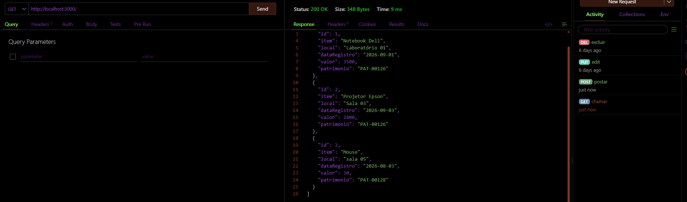
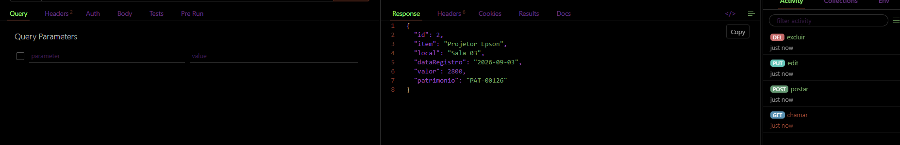
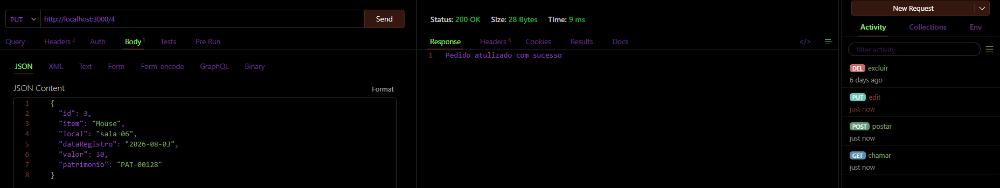
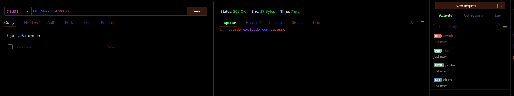

# Back-End crud

o sistema possui produtos de uma loja de informatica cada produto possui informações como:
- id
- nome do item
- local
- registro de data
- valor
- numero do patrimonio

essas são as rotas para alterações:

get(mostrar), delete (deleta um item) e put (altera propriedades de um item)

# Post (cria um item)

# Get (Mostra todos os itens)

# Get/id (mostra um item pelo id)

# Put (Altera informações de um item)

# Delete (Exclui um item)

